# GreyCells Coding Agent

A multi agent collaboration loop (PM -> Coder -> Tester -> Executor -> Debugger(Testcase + Source) ) to automatically generate high quality python code. Just like `Hercule Poirot`'s little grey cells, our GreyCells Coding Agent uses its little grey circuits to think through the problem.

## Core Features

*   **Multi Agent Collaboration**: Completely replicated the Project manager, programmer/coder, test engineer, debug expert workflow in development processes.

*   **Property Based Testing**: 20% happy path + 80% random path, do not assert answer, but checks property.
*   **Markdown**:
    * LLM generates markdown structure, contains reasoning and output code. The markdown structure is parsed using markdown-it-py in lieu of regex to extract JSON fields.
    * The Abstract Semantic Tree (AST) can accurately extract code blocks, regardless of indentation and new line characters (disasterous for JSON output).

    * Avoided using JSON for final output, because it may suffer from the `Escaping Hell` problem, in the case of multiline strings.


* **Schema-Driven Extraction**: Implemented a universal extractor, by passing a Schema such as Target_file vs Content, it can be adapted to the output of all agents.


* **Fault Tolerance (Anti-Fragile)**:

    * Wrapper Peeling: automatically identify and "peal off" the ```markdown block the LLM may automatically add.

    * Auto-Completion: repair unclosed fences and lost Metadata.

    * Greedy Header Match: fuzzy match, to handle cases such as `## Target: SOURCE`, where the header and the word "SOURCE" is treated as a single header.


* **Structured Output**: The following standard is used for the testcase and initial coder.
    ```markdown
    ## Reasoning: Natural language chain of thoughts (CoT)

    ## Content: Python Code.

    ## Metadata: file metadata in the form of JSON.
    ```
    The following standard is used for the Debug agent:

    ```markdown
    ## Reasoning: Natural language chain of thoughts (CoT)

    ## Decision: FIX or REMAIN/VETO

    ## Content: Python Code.
    ```


*   **Self-correcting loop**: Real `python` code execution environment using `E2B`. If the testcase fails, the Debug Agent will automatically analyze the error and correct the source code AND/OR the testcase.
* **Solution to the `Oracle Problem`**:
    If the testcase itself is wrong, the LLM may chose to fix the source code to satisfy the wrong testcase.
    Solution: in debugging loop, fix the `Testcase` first, then run the original code with the new testcase again.
    If the testcase still fails, fix the `Source`.
*   **Dependencies**: LLM generates file metadata, including dependencies.
*   **LLM Call**: Use REST API to call `Google Gemini` model.


## Environment

*   Python 3.10+
*   Google Gemini API Key
* E2B API key

## Quick Start

### 1. Set Environment Variables

Configure the following environment variables to call the LLM. Either put the following keys in the .env file, let the python code load the .env file, or run the commands below.

**macOS / Linux:**
```bash
export LLM_API_KEY="your_google_gemini_api_key"
export LLM_MODEL="gemini-2.0-flash"  # default is gemini-2.0-flash
```

**Windows (PowerShell):**
```powershell
$env:LLM_API_KEY="your_google_gemini_api_key"
$env:LLM_MODEL="gemini-2.0-flash"
```

### 2. Run

Run `coding_agent.py` with your natural language requirement.

```bash
python coding_agent.py "写一个贪吃蛇游戏，使用命令行界面，WASD控制"
```
### 3. Check Output

After the program finishes, the results are in the `output/` directory. The actual names may differ

*   `output/main.py`: final runnable code
*   `output/test_generated.py`: final testcase


## 🚀 Architecture

### Testcase Agent:

Property-Based Testing (PBT): 80% random property test + 20% Happy Path, instead of hard coding assertions (even with no mental math, hard coded assertions tends to fail).

Debuggability Mandate: Enforce that when the assertion fails, the testcase prints the input parameters (e.g., f"Failed on input: {x}"), to provide critical clues to the Debug Agent.

Anti-Hallucination: Prompt uses universal logical examples instead of feature specific examples, preventing the model to overfit on the Few-Shot samples.

### Debug Agent (Testcase):

Firstly fix the testcase if the testcase objectively violates the `User Story`. Truth Hierarchy: User Story > Logic > Test, to prevent the agent to change the testcase just to make the source code pass it.


### Debug Agent (Source):
After the testcase fix did not result in a pass, the source is checked against the `UserStory`, `Testcase`, `Source Code` and `Execution Log`. Fix if only the source code objectively violates the `User Story`, or fails the testcase and it is the problem with the source code. Truth Hierarchy: User Story > Logic > Source, to prevent the agent to change the source code just to pass the testcase (a practical risk, because testcases are presented directly to the agent). Since PBT testcase has inherent randomness, the source code cannot hard code values to pass the testcase.


## Workflow

```mermaid

flowchart TD
    %% ---  ---
    classDef pm fill:#e1bee7,stroke:#4a148c,stroke-width:2px,color:#000
    classDef coder fill:#bbdefb,stroke:#0d47a1,stroke-width:2px,color:#000
    classDef tester fill:#ffecb3,stroke:#ff6f00,stroke-width:2px,color:#000
    classDef sandbox fill:#c8e6c9,stroke:#1b5e20,stroke-width:2px,stroke-dasharray: 5 5,color:#000
    classDef reviewer fill:#f0f4c3,stroke:#827717,stroke-width:2px,color:#000
    classDef endstate fill:#f5f5f5,stroke:#333,stroke-width:2px,color:#000

    %% --- Phase 1:  (Linear Setup) ---
    subgraph Phase1 ["Phase 1: Initialization"]
        direction TB
        Start((Start)) --> PMAgent
        
        PMAgent[("🧠 PM Agent<br/>(Analyze Reqs & Plan)")]:::pm
        PMAgent -->|Design Docs| CodingAgent
        
        CodingAgent[("👨‍💻 Coding Agent<br/>(Write Initial Code)")]:::coder
        CodingAgent -->|Source Code| TestcaseAgent
        
        TestcaseAgent[("🧪 Testcase Agent<br/>(Write Initial Tests)")]:::tester
    end

    %% --- Phase 2:  (The Loop) ---
    subgraph Phase2 ["Phase 2: Execution & Debug Loop"]
        direction TB
        
        TestcaseAgent --> Execution
        
        Execution["⚙️ Executor (Sandbox)<br/>(Run Code + Tests)"]:::sandbox
        Execution -->|Logs/Errors| Reviewer
        
        Reviewer[("🧐 Reviewer Agent<br/>(Analyze Failure Root Cause)")]:::reviewer
        Reviewer --> Decision{Pass?}
        
        %% 分支逻辑
        Decision -- "✅ All Pass" --> Success[Save Artifacts]:::endstate
        
        Decision -- "❌ Test Logic Error" --> FixTest[("🔧 Fix Testcase
        (step 1)")]:::tester
        Decision -- "❌ Source Logic Error" --> FixCode[("🔧 Fix Source Code
        (step 2)")]:::coder
        
        %% 闭环
        FixTest -->|Updated Tests| Execution
        FixCode -->|Updated Code| Execution
    end

    Success --> End((End))

```
